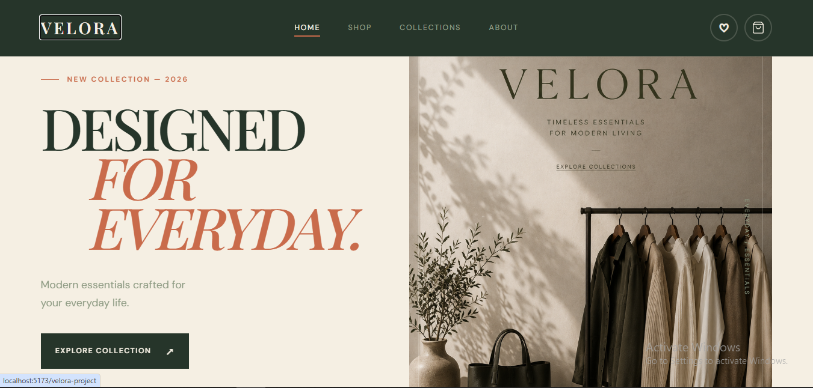
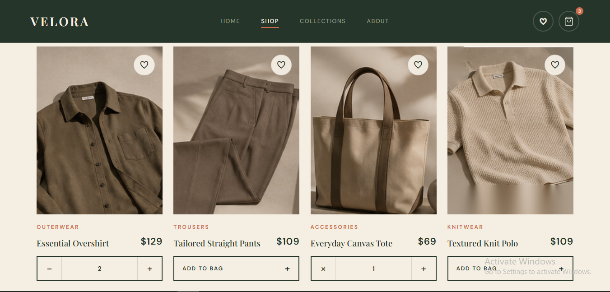
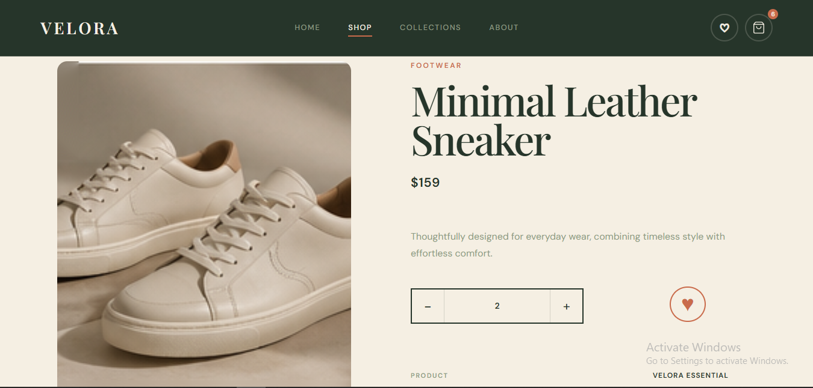
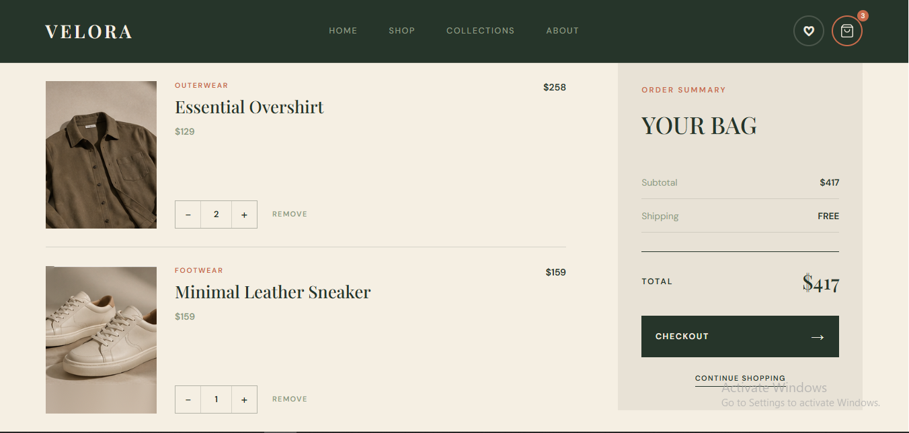
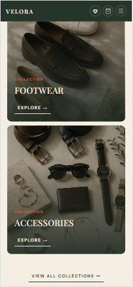

# VELORA

### Modern Fashion E-Commerce Experience

A modern, elegant, and fully responsive fashion e-commerce website built with **React 19**, **Vite**, **React Router**, and **Redux Toolkit**.

Velora is designed as a premium fashion storefront with a clean editorial aesthetic, reusable React components, product browsing, collections, product details, shopping cart, wishlist, responsive navigation, centralized state management, persistent client-side data, and a mobile-first experience.

> **Live Demo:**

> https://reza7mohammadi.github.io/velora-project/

---

## ✨ Overview

**Velora** is a frontend e-commerce project focused on creating a polished shopping experience while maintaining a clean and scalable React architecture.

The project combines:

* Minimal and elegant visual design
* Responsive layouts
* Reusable React components
* Client-side routing
* Centralized state management with Redux Toolkit
* Product browsing and filtering
* Product details
* Shopping cart functionality
* Wishlist functionality
* Persistent cart and wishlist data
* Dynamic navigation
* Responsive mobile navigation
* Interactive UI elements
* GitHub Pages deployment

The goal was to build a realistic fashion storefront rather than a simple static landing page.

---

## 🚀 Live Demo

### [View Velora](https://reza7mohammadi.github.io/velora-project/)

Explore the deployed version of the project on GitHub Pages.

---

## 📸 Screenshots

### 🏠 Home

The homepage introduces the Velora brand with a large hero section, featured categories, products, brand story, newsletter section, and footer.



---

### 🛍️ Shop

The shop page provides a complete product browsing experience with product cards and category-based organization.



---

### 👗 Product Details

Each product has its own dedicated details page with product information and shopping actions.



---

### 🛒 Shopping Cart

The cart page allows users to review their selected products and manage their shopping items.



---

### 📱 Responsive Experience

Velora adapts its layout and navigation to smaller screen sizes.

The responsive navigation includes a dedicated mobile menu that appears below **900px**, replacing the desktop navigation with an interactive menu button.



---

# ✨ Features

## 🏠 Home Page

The homepage is designed as the main entry point of the storefront and includes:

* Premium hero section
* Brand introduction
* Featured categories
* Featured products
* Brand story section
* Newsletter section
* Responsive footer
* Clear call-to-action elements

---

## 🛍️ Shop

The Shop page provides a dedicated product browsing experience.

Features include:

* Product grid
* Product cards
* Product images
* Product names
* Product prices
* Product navigation
* Category-based organization
* Responsive product layout

---

## 📚 Collections

Velora includes a dedicated collections experience for browsing products through fashion categories.

Available categories include:

* Outerwear
* Knitwear
* Trousers
* Footwear
* Accessories

The collection structure is designed to make product discovery easier and provide a more organized shopping experience.

---

## 👗 Product Details

Every product can be opened through its own product details page.

The product details experience includes:

* Product image
* Product name
* Product price
* Product description
* Product information
* Add-to-cart functionality
* Wishlist functionality
* Navigation back to shopping
* Responsive layout

React Router is used to provide dedicated URLs for individual products.

---

## 🛒 Shopping Cart

Velora includes client-side shopping cart functionality managed with **Redux Toolkit**.

Users can:

* Add products to the cart
* View selected products
* Increase product quantities
* Decrease product quantities
* Remove products from the cart
* Track product quantities
* See the total number of items
* Navigate to the cart
* Manage their shopping selection

The cart state is stored centrally in the Redux store, making it accessible across different components and pages.

The cart data is also persisted in **localStorage**, allowing the shopping cart to remain available after refreshing the page.

The navigation bar displays a dynamic cart counter based on the Redux cart state.

---

## ♡ Wishlist

The project includes a dedicated Wishlist page accessible directly from the navigation bar.

Wishlist state is managed using **Redux Toolkit** and is available across the application.

Users can:

* Add products to the wishlist
* Remove products from the wishlist
* View saved products
* Access the wishlist from the navigation bar
* Keep wishlist data after refreshing the page

Wishlist data is persisted in **localStorage** through Redux middleware.

---

## ⚛️ Redux State Management

Velora uses **Redux Toolkit** for centralized state management.

The application currently manages:

* Shopping cart state
* Wishlist state

The Redux store is configured using `configureStore`, while individual features are organized into separate slices.

### Cart Slice

The Cart slice manages:

* Adding products
* Removing products
* Increasing quantity
* Decreasing quantity

### Wishlist Slice

The Wishlist slice manages:

* Adding products
* Removing products

This structure keeps state-related logic separated from UI components and makes the application easier to maintain and scale.

---

## 💾 Local Storage Persistence

Velora uses `localStorage` to persist Cart and Wishlist data between page refreshes.

A custom Redux middleware monitors Cart and Wishlist actions and automatically saves the updated state to localStorage.

The application also reads previously saved data from localStorage when the Redux slices are initialized.

### Persistence Flow

```text
User Interaction
       ↓
Redux Action
       ↓
Redux Reducer
       ↓
Updated Redux State
       ↓
Local Storage Middleware
       ↓
localStorage
```

On application startup:

```text
localStorage
      ↓
Redux Slice Initial State
      ↓
Redux Store
      ↓
React Components
```

This allows users to keep their cart and wishlist data after refreshing the page.

---

## 📱 Responsive Navigation

The navigation system adapts to different screen sizes.

### Desktop

On larger screens, Velora displays the complete navigation:

```text
VELORA      HOME   SHOP   COLLECTIONS   ABOUT      ♡   🛍
```

### Mobile / Tablet

Below **900px**, the desktop navigation is replaced by a menu button.

```text
VELORA                              ☰
```

Clicking the menu button opens the mobile navigation.

The menu includes:

* Home
* Shop
* Collections
* About
* Wishlist
* Cart

The menu also:

* Animates when opening
* Changes the menu icon to a close icon
* Closes after selecting a navigation item
* Automatically closes when returning to desktop width

---

# 🎨 Design

Velora follows a minimal fashion-editorial design language.

The interface focuses on:

* Elegant typography
* Neutral color palette
* Olive-inspired tones
* Cream backgrounds
* Terracotta accents
* Generous spacing
* Clean product presentation
* Subtle hover animations
* Rounded interactive elements
* Responsive layouts

The design system is shared across the different pages to maintain visual consistency.

---

# 🧩 Reusable Components

The application is structured around reusable React components.

### Components

* `Navbar`
* `Hero`
* `Categories`
* `Products`
* `ProductCard`
* `BrandStory`
* `Newsletter`
* `Footer`

This structure keeps the UI modular and makes individual sections easier to maintain and reuse.

---

# 🗂️ Pages

Velora currently includes the following pages:

| Page                | Description                            |
| ------------------- | -------------------------------------- |
| **Home**            | Main storefront and brand introduction |
| **Shop**            | Product browsing experience            |
| **Collections**     | Category-based product discovery       |
| **Product Details** | Individual product information         |
| **Cart**            | Shopping cart management               |
| **Wishlist**        | Saved products                         |
| **About**           | Brand story and information            |

---

# 🛠️ Tech Stack

### Frontend

* **React 19**
* **React DOM**
* **Vite**
* **React Router DOM**
* **Redux Toolkit**
* **React Redux**

### State Management

* **Redux Toolkit**
* Redux slices
* Redux middleware
* Centralized application state

### Persistence

* Browser `localStorage`
* Custom Redux middleware for state persistence

### UI & Icons

* **Lucide React**
* Custom CSS
* Responsive CSS layouts
* CSS transitions and animations

### Development Tools

* **ESLint**
* **Vite**
* **npm**

---

# ⚛️ React Architecture

The project follows a component-based architecture with feature-based Redux state management.

```text
src/

│
├── app/
│   ├── store.js
│   └── localStorageMiddleware.js
│
├── assets/
│   ├── categories/
│   ├── products/
│   ├── brandstory.png
│   └── hero-img.png
│
├── components/
│   ├── BrandStory/
│   ├── Categories/
│   ├── Footer/
│   ├── Hero/
│   ├── Navbar/
│   ├── Newsletter/
│   ├── ProductCard/
│   └── Products/
│
├── data/
│   ├── categories.js
│   └── products.js
│
├── features/
│   ├── cart/
│   │   └── cartSlice.js
│   └── wishlist/
│       └── wishlistSlice.js
│
├── pages/
│   ├── About/
│   ├── Cart/
│   ├── Collections/
│   ├── Home/
│   ├── ProductDetails/
│   ├── Shop/
│   └── Wishlist/
│
├── App.jsx
├── index.css
└── main.jsx
```

The `app` directory contains the Redux store and application-level middleware.

The `features` directory contains Redux slices organized by application feature.

This structure keeps state management logic separated from UI components while allowing components to access the centralized Redux state when needed.

---

# 🧭 Routing

Client-side navigation is implemented with **React Router DOM**.

The application uses routes for:

```text
/
├── /shop
├── /collections
├── /about
├── /wishlist
├── /cart
└── /shop/product/:id
```

For GitHub Pages deployment, the application also uses:

* Vite `base`
* React Router `basename`

This ensures that routing works correctly under:

```text
/velora-project/
```

---

# 📦 Product Data

Products and categories are separated from the UI components.

```text
src/data/

├── products.js
└── categories.js
```

This separation makes the product catalog easier to maintain and allows the UI components to remain focused on presentation and interaction.

---

# 📱 Responsive Design

Velora is designed to provide a consistent experience across:

* Desktop
* Laptop
* Tablet
* Mobile

Responsive behavior includes:

* Adaptive navigation
* Mobile menu
* Responsive product grids
* Flexible layouts
* Responsive typography
* Mobile-friendly spacing
* Adaptive buttons and controls
* Responsive images

The main mobile navigation breakpoint is:

```css
@media (max-width: 900px)
```

---

# ⚡ Performance

The application is built with Vite and optimized for production builds.

The production build includes:

* Code bundling
* CSS optimization
* Asset hashing
* Production-ready JavaScript
* Optimized static assets

Build command:

```bash
npm run build
```

---

# 🚀 Deployment

Velora is deployed using **GitHub Pages** and **GitHub Actions**.

Every push to the `main` branch can trigger the deployment workflow.

### Deployment Flow

```text
Git Push
   ↓
GitHub Actions
   ↓
Install Dependencies
   ↓
npm run build
   ↓
Create GitHub Pages Artifact
   ↓
Deploy
   ↓
Live Website
```

### Live Website

https://reza7mohammadi.github.io/velora-project/

---

# 🏷️ Version

Current release:

**v1.0.0**

---

# ⚙️ Installation

Clone the repository:

```bash
git clone https://github.com/Reza7Mohammadi/velora-project.git
```

Navigate into the project:

```bash
cd velora-project
```

Install dependencies:

```bash
npm install
```

---

# 💻 Development

Start the development server:

```bash
npm run dev
```

Then open the local URL provided by Vite.

The development environment uses the same application routing structure as the production project.

---

# 📦 Production Build

Create a production build:

```bash
npm run build
```

Preview the production build locally:

```bash
npm run preview
```

---

# 🧹 Linting

Run ESLint:

```bash
npm run lint
```

The project is currently passing the ESLint check successfully.

---

# 📜 Available Scripts

| Command           | Description              |
| ----------------- | ------------------------ |
| `npm run dev`     | Start development server |
| `npm run build`   | Create production build  |
| `npm run preview` | Preview production build |
| `npm run lint`    | Run ESLint               |

---

# 📁 Repository

**GitHub Repository**

https://github.com/Reza7Mohammadi/velora-project

---

# 👨‍💻 Author

**Reza Mohammadi**

Frontend Developer focused on building modern and responsive web experiences with React.

**GitHub**

https://github.com/Reza7Mohammadi

---

## ⭐ Project Highlights

Velora demonstrates practical frontend development concepts including:

* ⚛️ React component architecture
* 🧭 Client-side routing
* 🛍️ E-commerce UI development
* 🛒 Shopping cart functionality
* ♡ Wishlist experience
* ⚛️ Redux Toolkit state management
* 🔄 Redux middleware
* 💾 localStorage state persistence
* 📱 Responsive design
* ☰ Mobile navigation
* 🎨 Design system consistency
* 🧩 Reusable components
* 📦 Separated product data
* ⚡ Vite development workflow
* 🧹 ESLint integration
* 🚀 GitHub Actions deployment
* 🌐 GitHub Pages hosting

---

## 📄 License

This project was created for portfolio and educational purposes.
